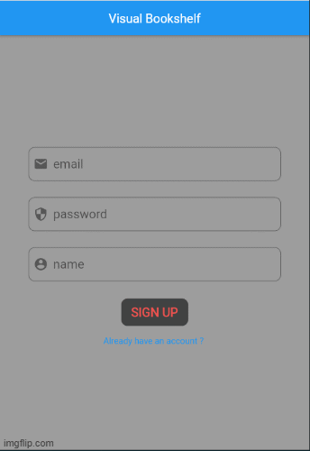

# project_gutenberg
A user-friendly interface for searching books from Gutenberg project and collecting the chosen books in a visual bookshelf for a specific user of the system. 

# Summary

---
This is an mobile app for reading books online. It uses Gutenberg's saerch page to saerch books from all 600k+ books in gutenberg. You can add your favorite books in your bookshelf to read them later on. You can also add bookmark to your book when you finish your daily reading then you can continue to read where you left before.

# Tech Stack

---
*   http: ^0.13.4
*  html: ^0.15.0
*  firebase_core: ^1.10.5
*  firebase_auth: ^3.3.3
*  cloud_firestore: ^3.1.4
*  visibility_detector: ^0.2.2
*  indexed_list_view: ^2.0.1
*  minSdkVersion: 21
*  targetSdkVersion: 30

# Prerequisties

---
* Firebase

# Run & Build

Once you download the project, make sure to run 'pub get' script then you can run the program 

---
- $ cd project_gutenberg
- $ pub get

